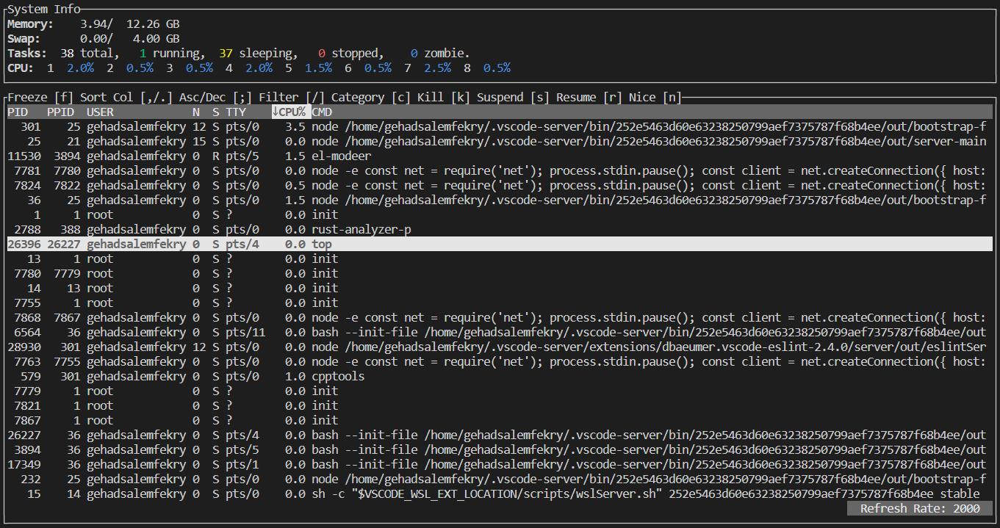
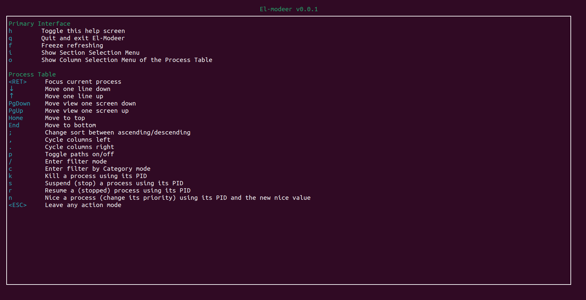

# ElModeer

## In terminal Process Manager for your system written in Rust



## Features

- Quick glances at System information (CPU, Memory, Processes)
- A filterable process table that includes per process disk usage
- Sorting process table by any column
- Change process priority
- Managing processes with signals (kill, terminate, suspend, continue)
- Tree view of processes


## Building

### Prerequisites

Building requires rust version >= 1.40 and libclang development packages.

#### Rust:
Install from your preferred package manager or preferrably use [rustup.rs](https://rustup.rs/)

#### [Clang](https://clang.llvm.org/) development packages:
- Ubuntu/Debian:
`sudo apt-get install libclang-dev`

ElModeer builds under rustc version >= 1.40.0.

```
cd el-modeer
cargo build --release
```

## Usage

Running with no arguments starts ElModeer with the system info and process table and a refresh rate of 2000 ms (2 seconds). These can be changed with command line parameters:

```USAGE:
    el-modeer [FLAGS] [OPTIONS]

FLAGS:
    -h, --help               Prints help information
    -V, --version            Prints version information
    -t, --tree               Start GUI tree

OPTIONS:
    -p, --process-height <INT>    Min Percent Height of Process Table. [default: 32]
    -s, --system-info-height <INT>  Min Percent Height of System information. [default: 7]
    -r, --refresh-rate <INT>      Refresh rate in milliseconds. [default: 2000]
```

Don't want a section? Remove it by setting the height to 0. 

For example: ```deer -p 0``` removes the System Information.

In ElModeer 'h' key will show this help:




This process manager extends builds upon the Zenith process manager, so great thanks to them!
